# AWS: EC2 - S3


##  Prerrequisitos

###  Cuenta y permisos AWS

1. Tener una cuenta AWS activa.
2. Tener usuario IAM con permisos sobre:
- EC2 - full access
- S3 - full access

IAM > USERS > CREATE USER

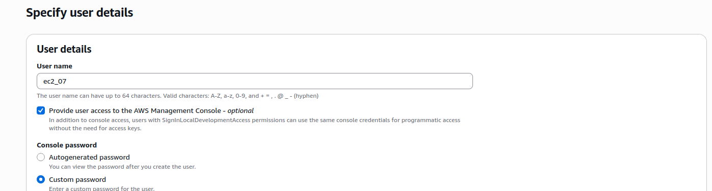

PERMISOS

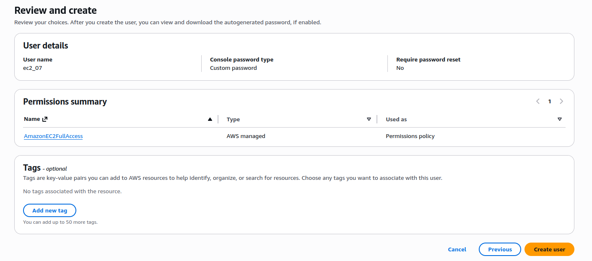

**Realizar lo mismo para el usuario del S3,pero con el permiso S3 full access**

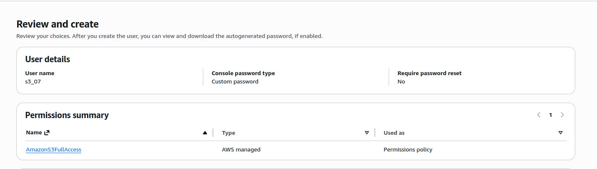

###  EC2

1. Entrar al usuario IAM


###  Crear Security Group

En `EC2 -> Security Groups -> Create security group`:

1. Name: `semana11-backend-sg`
2. Description: `Acceso backend semana11`
3. Inbound rules:
- `SSH` | Port `22` | `0.0.0.0/0`
- `Custom TCP` | Port `3001` | Source `0.0.0.0/0` (para pruebas)
4. Outbound rules:
- Mantener `All traffic` permitido (default)

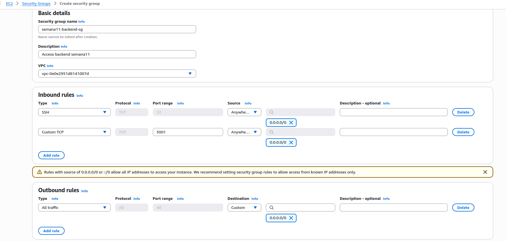


### Lanzar instancia EC2

En `EC2 -> Instances -> Launch instances` usar:

1. Name: `semana11-backend`
2. AMI: `UBUNTI` 

3. Instance type: `t3.micro` 


4. Key pair: `semana11-key`

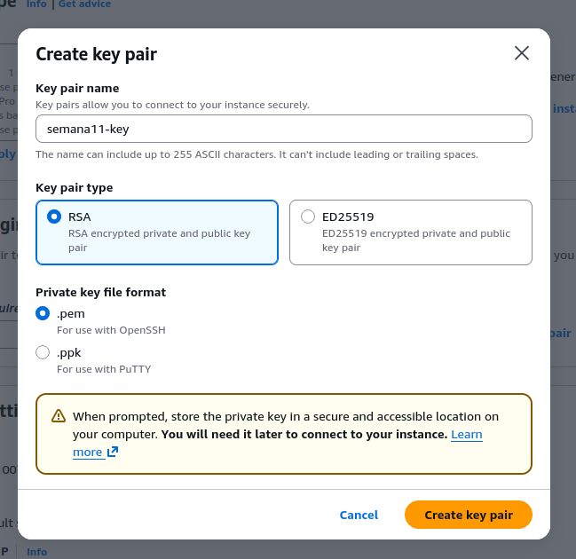

- Create new keypair (guardar el archivo)

5. Network settings:
- Auto-assign public IP: `Enable`
- Security group: `semana11-backend-sg`
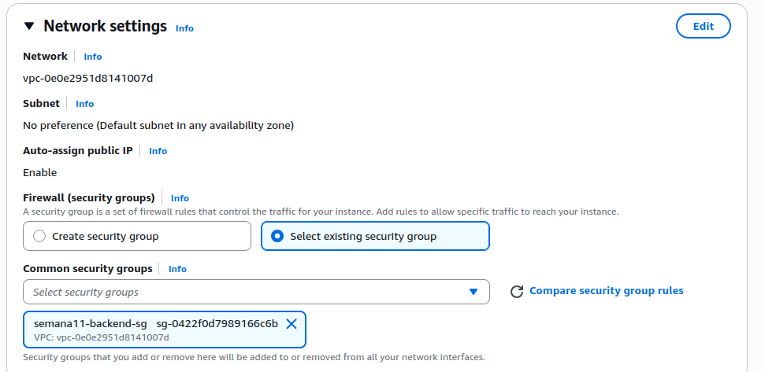

7. Launch instance

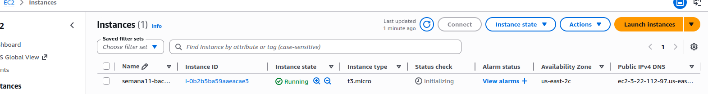


### Conectarse por SSH

Darle click a la instancia y luego al boton en la esquina derecha que dice connect.
Dirigirse a SHH y seguir los pasos

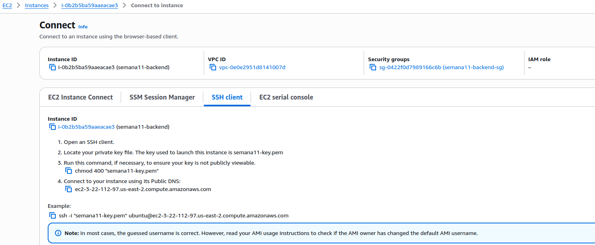

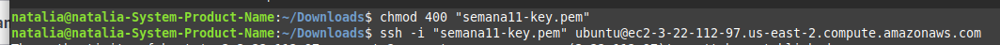

###  Instalar dependencias del servidor

Dentro de EC2:

```bash
sudo apt update -y
sudo apt upgrade -y
sudo apt install -y git g++ make build-essential curl ca-certificates
curl -fsSL https://deb.nodesource.com/setup_20.x | sudo -E bash -
sudo apt install -y nodejs
sudo apt install graphviz
dot -V
node -v
npm -v
g++ --version
```


###  Clonar el proyecto y compilar el binario 

```bash
git clone https://github.com/nxz7/Ejemplos_MIA_S12026
cd Ejemplos_MIA_S12026/Semana11
grep -q '#include <cstring>' fdisk.cpp || sed -i '/#include <cctype>/a #include <cstring>' fdisk.cpp


g++ -std=c++17 main.cpp analizador.cpp mkdisk.cpp rmdisk.cpp fdisk.cpp mount.cpp mkfs.cpp rep.cpp journaling.cpp \
    reportes/mbr.cpp reportes/disk.cpp reportes/inode.cpp reportes/bm_inode.cpp reportes/block.cpp -o clase11
chmod +x clase11
```

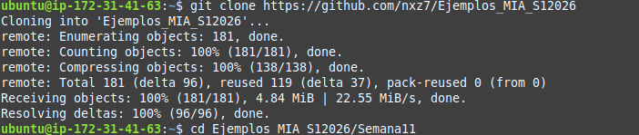

Validación mínima:

```bash
./clase11
```

Si el programa corre es que esta bien

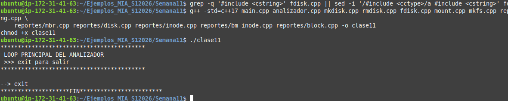

### Instalar dependencias del backend

```bash
cd /home/ubuntu/Ejemplos_MIA_S12026/Semana11/backend
npm ci
```

###  Levantar backend 


```bash
cd /home/ubuntu/Ejemplos_MIA_S12026/Semana11/backend
PORT=3001 FRONTEND_ORIGIN=http://localhost:5173 npm run dev
```

Notas:

1. Deja esta terminal abierta mientras pruebas.
2. Como aun no esta el S3, usa temporalmente `FRONTEND_ORIGIN=http://localhost:5173`, pero luego si se cambia

Verificar API (en otra terminal):

```bash
curl http://IP_EC2:3001/api/health
```


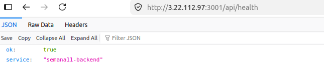


---
# S3

###  Configurar URL del backend para build

En la maquina local:

```bash
cd Semana11/frontend
cat > .env.production << 'EOF2'
VITE_API_URL=http://IP_EC2:3001
EOF2
```


```bash
npm ci
npm run build
```

Se genera: `Semana11/frontend/dist`

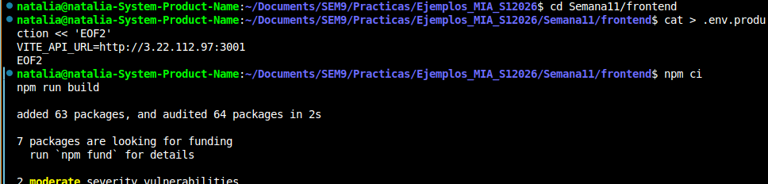


### 2.3 Crear bucket y hosting estatico

En AWS S3:

1. Crear bucket 

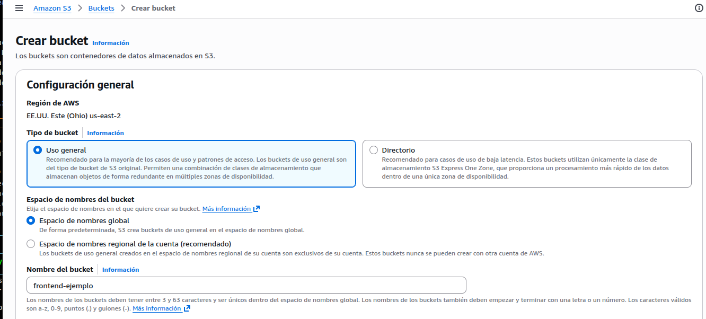


2. Quitar `Block all public access`

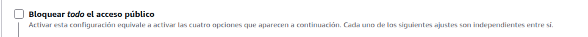
3. Habilitar `Static website hosting`

Entrar al bucket > propiedades > al final

-  `Index document`: `index.html`
-  `Error document`: `index.html`

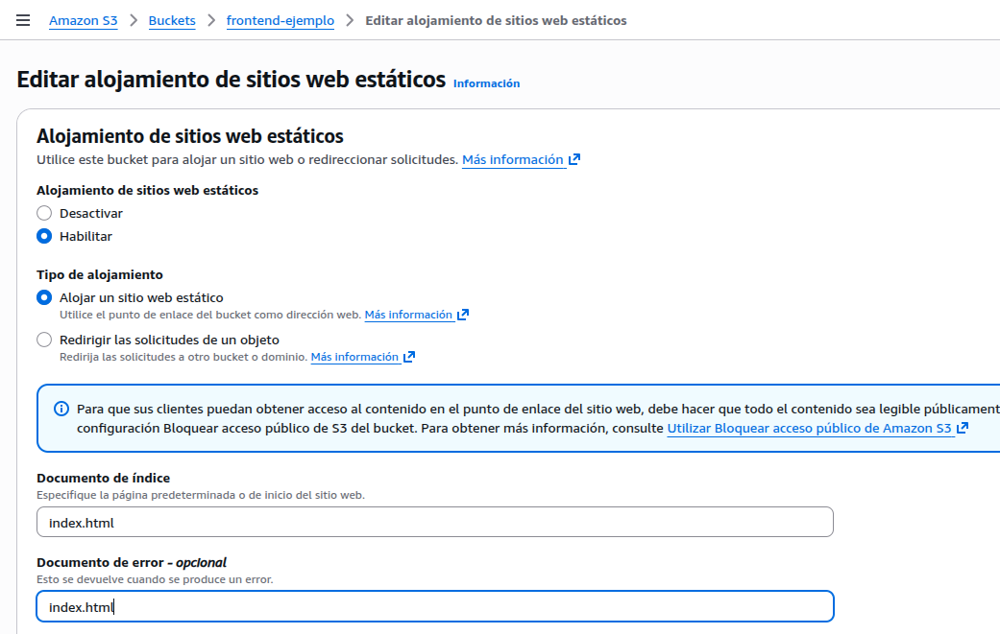

###  Policy publica del bucket

bucket> PERMISOS

```json
{
  "Version": "2012-10-17",
  "Statement": [
    {
      "Sid": "PublicReadGetObject",
      "Effect": "Allow",
      "Principal": "*",
      "Action": "s3:GetObject",
      "Resource": "arn:aws:s3:::frontend-ejemplo/*"
    }
  ]
}
```
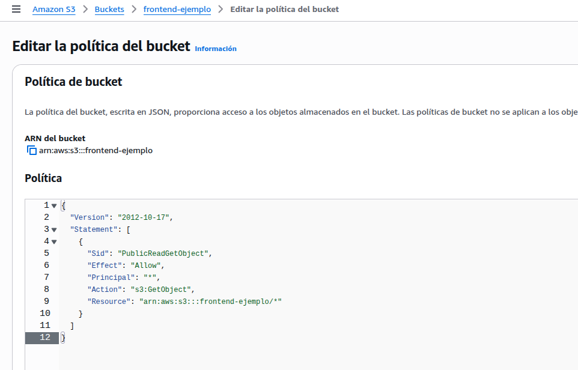


###  Subir frontend

Subir el contenido interno de `dist` al bucket (no subir la carpeta `dist`)

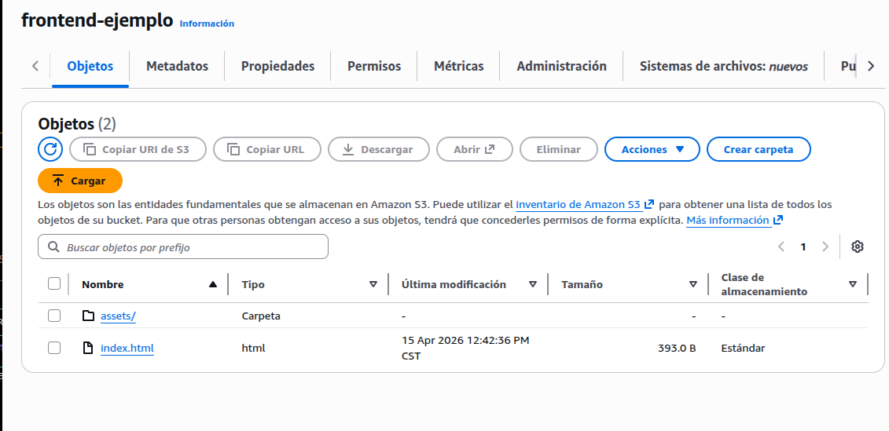

###  COMPROBAR

>FRONTEND > PROPIEDADES > HASTA ABAJO (esta la url)


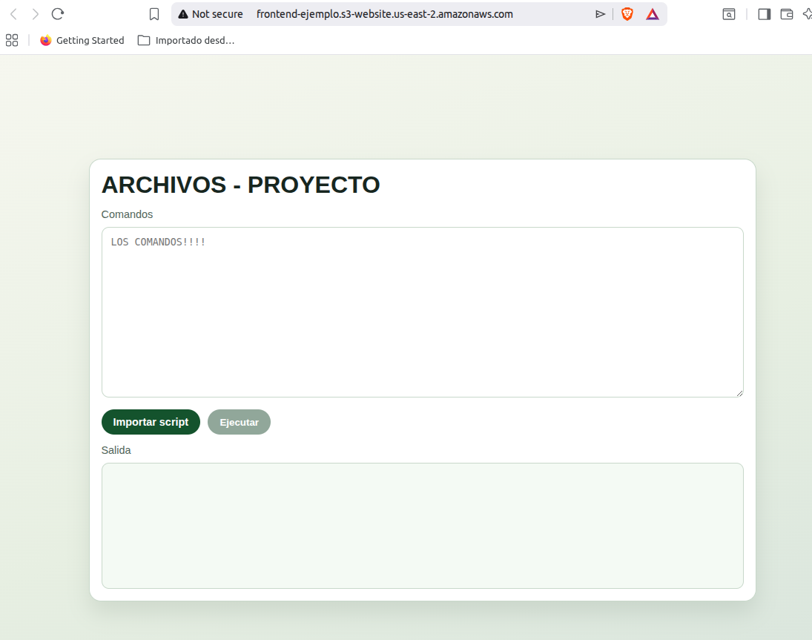

---

## Ajuste CORS final -- CONECTAR CON EL BACKEND

Cuando ya tengas el endpoint real de S3, vuelve a levantar backend (desde la ec2) con:

```bash
cd /home/ubuntu/Ejemplos_MIA_S12026/Semana11/backend
PORT=3001 FRONTEND_ORIGIN=links3 npm run dev
```

## TEST FINAL
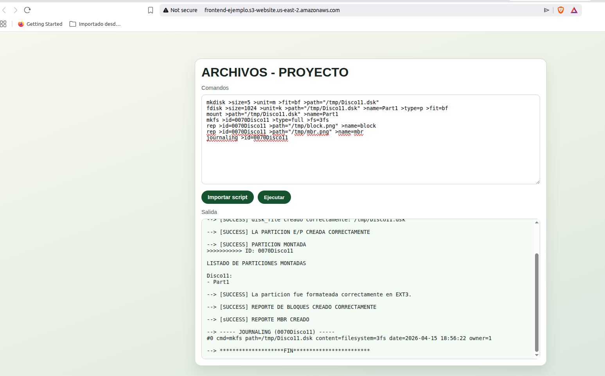